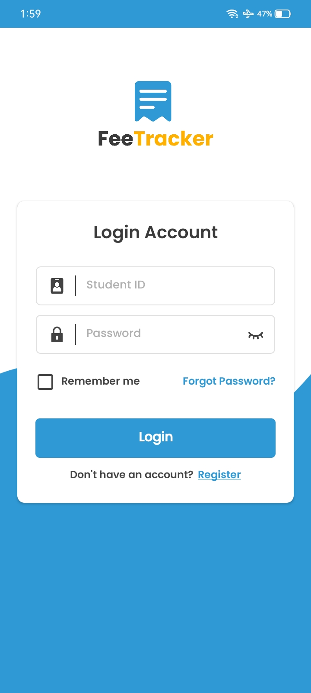
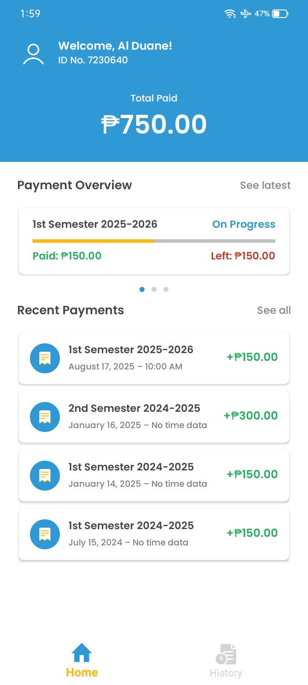
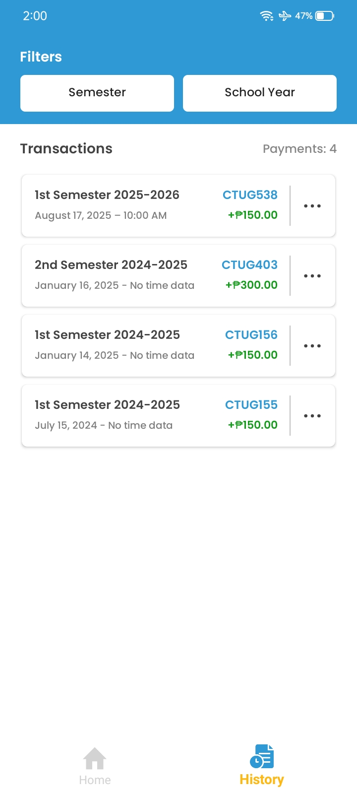
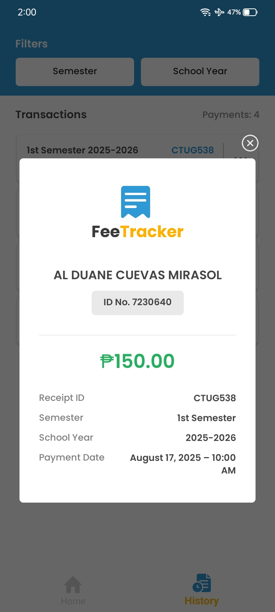

# Al Duane Cuevas Mirasol

**`BSIT Student | Aspiring Full-Stack Developer`**

## About Me

- 🎓 3rd-Year BSIT Student at CTU Ginatilan Campus
- 💻 8 months experience as Full-Stack Developer & Team Lead
- ❤️ Passionate about scalable apps and performance optimization
- ⚡ Enjoys building efficient, maintainable, and user-focused systems

<h2>Current Projects</h2>

  

    
    
    
    
  

  <h3 style="margin:8px 0 4px;">FeeTracker</h3>
  
School app for tracking student fee payments, transactions, and receipts

  
<strong>Tech:</strong> C#, .NET MAUI, MySQL

  

    
    <h3>TiendaApp</h3>
    
POS & inventory management app for government agency

    
<strong>Tech:</strong> C#, .NET MAUI, MySQL

  

## Skills & Tech Stack

  

## Learning & Goals

- Learning **React, React Native, and System Design**
- Long-term goal: Aspiring to become a **Professional Full-Stack Developer** with strong expertise in frontend, backend, databases, APIs, and deployment.

## GitHub Stats

  

## Contact Me

  
  
  

